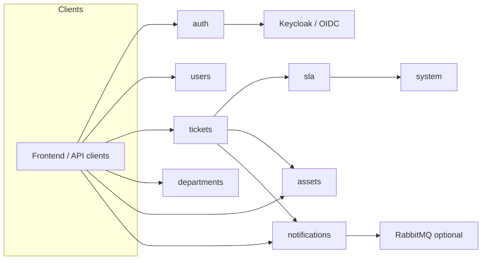

# HelpDesk backend — application modules

This document describes each Python package under `src/app/`: responsibility, main types, and how modules relate. API routes are mounted under `settings.api_prefix` (default `/api/v1`).

## Application shell

| Location | Role |
|----------|------|
| [`main.py`](../src/app/main.py) | FastAPI app factory, CORS, router registration, lifespan (DB init, optional RabbitMQ outbox dispatcher), health and root routes. |
| [`config.py`](../src/app/config.py) | `Settings` (Pydantic): database, Keycloak/OIDC, MinIO, RabbitMQ outbox, CORS, ticket numbering, etc. Access via `get_settings()`. |

## Module index

| Module | Purpose |
|--------|---------|
| [core](#core) | Shared infrastructure: async SQLAlchemy base, DB session, security helpers, HTTP utilities, enums. |
| [auth](#auth) | OIDC/Keycloak login, token refresh, PKCE, JWT validation, current-user dependencies. |
| [user](#user) | User CRUD, roles/permissions, sync with IdP; backs authorization checks. |
| [department](#department) | Organizational departments; used by tickets and users. |
| [ticket](#ticket) | Tickets, categories, workflow (assign, approve, progress, complete, close), asset links. |
| [asset](#asset) | Physical assets, images in MinIO, lifecycle, department scoping. |
| [notification](#notification) | In-app notifications, transactional outbox, RabbitMQ publisher. |
| [sla](#sla) | SLA deadlines and status from priority + system settings. |
| [system](#system) | Key-value `system_settings` (e.g. SLA hours per priority). |

Each section below summarizes one package; per-module `README.md` files under `src/app/<module>/` give a quick local index. Deeper API detail lives in routers and Pydantic schemas.

---

## core

**Path:** `src/app/core/`

Shared **database** layer (`Base`, `BaseModel`, `TimestampMixin`, async engine/session, `get_db_session`), **enums** (`TicketStatus`, `TicketPriority`, etc.), and **cross-cutting** helpers (`security`, `http`).

**Depends on:** `config` only for DB settings.

**Used by:** All modules that persist data or share enums.

---

## auth

**Path:** `src/app/auth/`

**Authentication** with **Keycloak** (or compatible OIDC): authorization URL with PKCE, callback exchange, refresh token, logout URL. **JWT** parsing and `get_current_user` / role extraction for protected routes.

**Routers:** `/auth/*`

**Depends on:** `config`, `user` (user sync or lookup).

---

## user

**Path:** `src/app/user/`

**Users** aligned with the identity provider: CRUD (permission-gated), profile, **roles** for API authorization. Repositories encapsulate SQLAlchemy access.

**Routers:** `/users/*`

**Depends on:** `auth` for `TokenUser` / current user.

---

## department

**Path:** `src/app/department/`

**Departments** (organizational units). Tickets and users reference departments for scoping and assignment rules.

**Routers:** `/departments/*`

---

## ticket

**Path:** `src/app/ticket/`

**Tickets**: categories, templates, executors, status workflow, comments/progress, links to **assets**. Integrates **SLA** for `planned_completion_date` and `sla` on responses.

**Routers:** `/tickets/*`

**Depends on:** `user`, `asset`, `notification`, `sla` (optional in constructor but wired in DI).

---

## asset

**Path:** `src/app/asset/`

**Assets** (inventory): metadata, **MinIO** image upload/delete, filters and pagination, department access rules.

**Routers:** `/assets/*`

**Depends on:** `auth`, `user`.

---

## notification

**Path:** `src/app/notification/`

**Notifications** for the current user (list, mark read). Creation is driven from ticket flows; delivery uses a **transactional outbox** table and an optional **RabbitMQ** dispatcher started in app lifespan.

**Routers:** `/notifications/*`

---

## sla

**Path:** `src/app/sla/`

**SLA logic only** (no dedicated HTTP router): computes **planned completion** from priority and **system_settings**, and **SLA status** (`on_track`, `at_risk`, `overdue`, completed on time/late). Consumed by **ticket** service.

**Depends on:** `system` (`SystemService` for SLA hours).

---

## system

**Path:** `src/app/system/`

**System settings** key-value store (e.g. `sla.*.hours`, ticket number prefix). Exposed to other modules via **SystemService** (read SLA configuration). No public REST router in the current tree.

**Depends on:** `core` (DB).

---

## Diagram (data flow)

---

## Related docs

- [LOCAL_DEV.md](LOCAL_DEV.md) — local setup
- [KEYCLOAK_SETUP.md](KEYCLOAK_SETUP.md) — identity provider
- [DOCKER.md](../../DOCKER.md) (repo root) — containers
